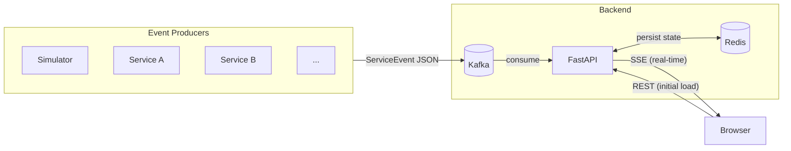

## On the importance of status page
It has been brought to my attention that, although simple to implement, internal apps rarely have a dedicated status monitoring page. Not having a status page somehow feels like undermining the importance of internal apps. Even though lots of operational things are handled internally. Data processing, analytics, reporting; literally all the important work.

This time I'm challenging Claude Code to implement a simple realtime status page to highlight just how easy it is to build it. To push things even further, I'm starting on a blank project, no AGENTS.md, no agent skills, native agent tools (WebFetch, bash, write, etc), and no MCP.

## Architecture

Kafka receive realtime status update from services. Backend reads from Kafka topic and write to Redis, and yes no persistence is needed. Frontend serves it to the browser using SSE to continuously receive data from backend.

## Result
After about 10-15 minutes of doomscrolling and waiting for Claude to finish, I got a few errors and I asked Claude to fix it. Another 5 minutes, and I got the final app. Here's what it look like:

## Adopt or die
One unfortunate conclusion of this whole article is that, in 2026 LLMs are leading the revolution. Decades ago, things like this wouldn't even be achievable with even the smartest machine learning models. The narrative of generative AI as a multiplier is becoming a reality. I used to be a non-believer myself. But after getting bombarded and "brainwashed" by my company to use AI for my daily driver, I converted. I realized that if I resist the change, I would be the one getting pushed away. Sadly, or not, I had to adapt and I need to do it fast. So, don't be foolish and start using AI more or you'll be left behind.
